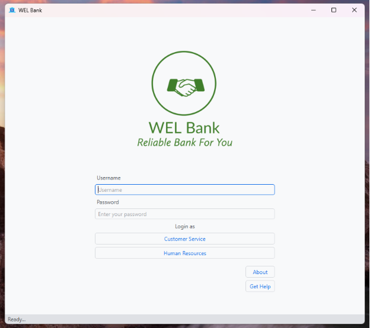
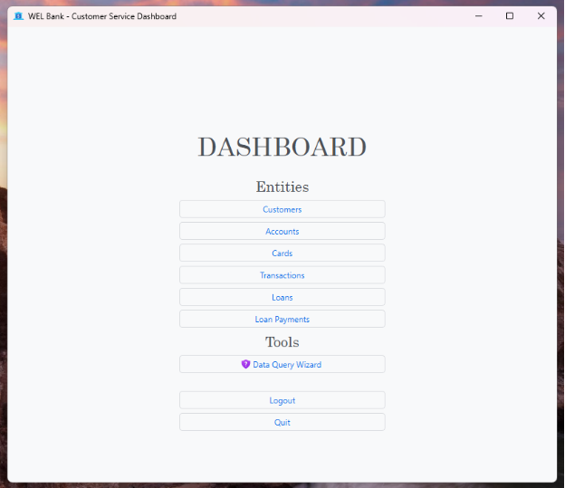
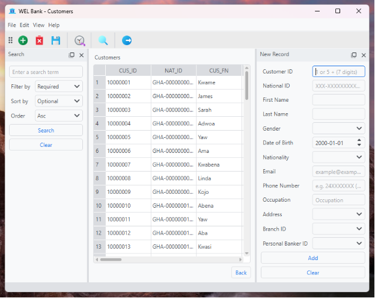
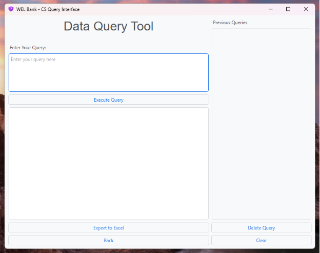

# Bank Database Management System
## Internal Management Software for a Bank using Python, PyQt6 and Oracle Database (cx_Oracle driver)

# OVERVIEW

This is a simulation of a simple Desktop Application for the internal use of a Bank, using Python.

#  FEATURES
- Customers Management (Registration, Details check)
- Accounts Management
- Transaction Management
- Employees Management

# Dependencies
- Python=3.11
- PyQt6
- cx_Oracle
- openpyxl
- pandas
- pyqtdarktheme

# Requirements
- Windows machine or Red Hat based linux distribution
- Oracle database 12C or later should be installed on the machine.
- Pluggable database (PDB) named 'WELBANK'
- WELBANK database should be populated using the SQL script provided
- Virtual environment using the aforementioned dependencies

# SCREENSHOTS
___

___

___

___

# LIMITATIONS

- Save and Rollback functionalities are decorative. Each insertion is automatically committed (see code).
- Delete record functionality does not work
- Transactions recorded will not reflect in Account Balance.
- Loans payments do not update loan balance.